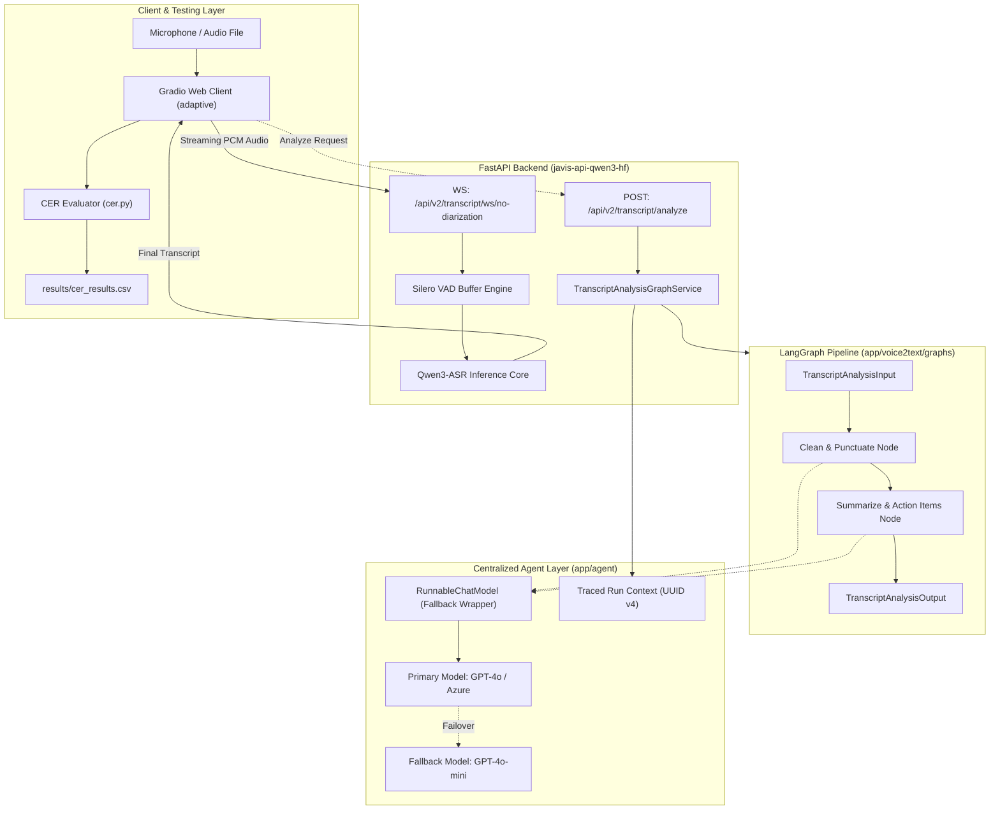

# BÁO CÁO TRIỂN KHAI HỆ THỐNG JAVIS ASR & LANGGRAPH AGENT

> **Dự án**: Javis ASR - Qwen3 Speech-to-Text Realtime & LangGraph Multi-Agent Architecture  
> **Ngày báo cáo**: 16/09/2026  
> **Môi trường**: Python 3.11 | FastAPI | LangGraph | PyTorch | Modal GPU  
> **Repository**: [Chanhhieudo102/javis_api_Qwen_ASR](https://github.com/Chanhhieudo102/javis_api_Qwen_ASR.git)

---

## 1. TỔNG QUAN DỰ ÁN

Dự án **Javis ASR & Transcript Agent** cung cấp giải pháp toàn diện cho xử lý âm thanh thời gian thực (Real-time Speech-to-Text) và phân tích hội thoại thông minh sau khi nhận diện giọng nói. Hệ thống kết hợp:
1. **Core ASR Realtime**: Mô hình Qwen3-ASR kết hợp VAD (Silero) streaming qua giao thức WebSocket độ trễ thấp.
2. **LangGraph Agent Engine**: Pipeline xử lý văn bản hội thoại (chuẩn hóa dấu câu, sửa lỗi ASR, tóm tắt nội dung và trích xuất danh sách công việc).
3. **Japanese Evaluation Framework**: Bộ công cụ chuẩn hóa và đánh giá độ chính xác nhận dạng tiếng Nhật (CER - Character Error Rate).
4. **Client & Benchmarking**: Giao diện Gradio tương tác mic/file, tự động ghi nhật ký và đối soát kết quả vào CSV.
5. **Serverless Infrastructure**: Tự động hóa đóng gói và triển khai mô hình lên Modal Cloud GPU.

---

## 2. KIẾN TRÚC HỆ THỐNG TỔNG THỂ



---

## 3. CHI TIẾT CÁC HẠNG MỤC ĐÃ TRIỂN KHAI

### 3.1 Tầng Agent Dùng Chung (`app/agent`)
Được thiết kế độc lập theo chuẩn **Single Provider Module**:
- **Protocol `ChatModel`** ([`chat_model.py`](file:///d:/VJ/Encode_API_Qwen/javis-api-qwen3-hf/app/agent/clients/chat_model.py)): Interface trừu tượng định nghĩa phương thức `ainvoke(messages, config) -> AIMessage`.
- **`RunnableChatModel`** ([`runnable_chat_model.py`](file:///d:/VJ/Encode_API_Qwen/javis-api-qwen3-hf/app/agent/clients/runnable_chat_model.py)):
  - Hỗ trợ cơ chế **Automatic Failover** qua `primary.with_fallbacks([fallback])`.
  - Tự động ghi warning log chuẩn khi xảy ra chuyển hướng model:  
    `"Failover occurred for purpose '{purpose}'. Primary model '{p}' failed, fallback model '{f}' responded."`
  - Bắt toàn bộ lỗi cạn kiệt fallback và chuẩn hóa thành ngoại lệ định kiểu `InternalServerException(ErrorConstants.Agent.MODEL_REQUEST_FAILED)`.
- **Định danh Tracing** ([`run_context.py`](file:///d:/VJ/Encode_API_Qwen/javis-api-qwen3-hf/app/agent/utils/run_context.py)): Sinh `traced_run_name` chuẩn định dạng `<graph_name>_<request_id>_<timestamp_utc>` với `request_id` là UUID v4.

---

### 3.2 Feature Graph: Phân Tích Hội Thoại (`transcript_analysis`)
Nằm trong package `app/voice2text/graphs/transcript_analysis/`:
- **State Schema** ([`state.py`](file:///d:/VJ/Encode_API_Qwen/javis-api-qwen3-hf/app/voice2text/graphs/transcript_analysis/state.py)):
  - `TranscriptAnalysisInput`: Nhận `raw_transcript`, `language`.
  - `TranscriptAnalysisState`: Lưu trữ trạng thái trung gian (`cleaned_transcript`).
  - `TranscriptAnalysisOutput`: Chỉ expose các trường nghiệp vụ (`cleaned_transcript`, `summary`, `action_items`), không rò rỉ trường scratch.
- **Class-based Nodes** ([`nodes.py`](file:///d:/VJ/Encode_API_Qwen/javis-api-qwen3-hf/app/voice2text/graphs/transcript_analysis/nodes.py)):
  - `TranscriptAnalysisCleanPunctuateNode`: Nhận văn bản thô, chỉnh sửa chính tả, thêm dấu ngắt câu, chuẩn hóa cấu trúc ngữ pháp.
  - `TranscriptAnalysisSummarizeActionsNode`: Phân tích ngữ cảnh, tóm tắt và trích xuất danh sách công việc/hành động dưới định dạng JSON.
  - Các instance của node chỉ chứa config (model, system prompt), **tuyệt đối không lưu request state vào `self`**.
- **Singleton Compile at Import** ([`registry.py`](file:///d:/VJ/Encode_API_Qwen/javis-api-qwen3-hf/app/voice2text/graphs/transcript_analysis/registry.py)):
  - Graph được compile 1 lần duy nhất tại import-time, hoàn toàn **stateless** (không dùng Checkpointer/MemorySaver).
- **REST API Endpoint** ([`routes.py`](file:///d:/VJ/Encode_API_Qwen/javis-api-qwen3-hf/app/voice2text/api/v2/routes.py)):
  - Tuyến `POST /api/v2/transcript/analyze` kết nối qua `TranscriptAnalysisGraphService`.

---

### 3.3 Hệ Thống Đánh Giá CER Chuẩn Tiếng Nhật (`cer.py`)
Triển khai class `JapaneseASREvaluator` hỗ trợ 3 thang đo CER chuyên dụng:
1. **CER Strict**: Loại bỏ thông tin người nói (Speaker tag) và dấu thời gian (Timestamp), giữ nguyên toàn bộ chữ Kanji, Hiragana, Katakana và ký tự gốc.
2. **CER Standard**: Chuẩn hóa tương thích Unicode NFKC, loại bỏ ký tự dấu câu tiếng Nhật và quốc tế (`、。・！？「」…`).
3. **CER Loose**: Chuẩn hóa toàn bộ văn bản về âm đọc Hiragana thuần túy thông qua thư viện phân tích từ vựng **Janome**, loại bỏ các từ đệm/filler words thường gặp (`えーと`, `あの`, `ええ`).
4. Hỗ trợ CLI linh hoạt: Đọc trực tiếp chuỗi hoặc tự động quét file trong thư mục `ground_truth/`.

---

### 3.4 Ứng Dụng Gradio Client & Tự Động Ghi Log (`03_openai_realtime_microphone_client_adaptive.py`)
Nâng cấp giao diện kiểm thử trực quan:
- **Tích hợp nguồn âm thanh**: Cho phép nói trực tiếp qua Microphone với thuật toán Adaptive thresholding hoặc chọn nhanh file `.wav`/`.mp3` có sẵn trong thư mục `all_audio_input/`.
- **Tự động liên kết Ground Truth**: Khi chọn file audio, ứng dụng tự động tìm và gợi ý file ground truth tương ứng trong `ground_truth/`.
- **Tính toán CER tự động**: Sau khi hoàn thành stream ASR, người dùng có thể kích hoạt đánh giá đối soát 3 thang đo ngay trên giao diện.
- **Tự động lưu lịch sử**: Toàn bộ kết quả benchmark được ghi nhận liên tục vào file [`results/cer_results.csv`](file:///d:/VJ/Encode_API_Qwen/results/cer_results.csv).

---

### 3.5 Quản Lý Lỗi & Đa Ngôn Ngữ (i18n)
Định nghĩa mã lỗi `ERR.AGT0101` (`ErrorConstants.Agent.MODEL_REQUEST_FAILED`) trên 3 ngôn ngữ:
- **Tiếng Anh (`error_en.yml`)**: `"AI model service request failed. Please try again later."`
- **Tiếng Nhật (`error_ja.yml`)**: `"AIモデルへのリクエストに失敗しました。しばらくしてからもう一度お試しください。"`
- **Tiếng Việt (`error_vi.yml`)**: `"Yêu cầu đến mô hình AI thất bại. Vui lòng thử lại sau."`

---

### 3.6 Cấu Hình Đám Mây & Triển Khai Modal GPU (`modal_run.py`)
- Cấu hình Modal App `javis-api-qwen3-hf-serve` đóng gói các thư viện `langgraph`, `langchain-core`, `langchain-openai`.
- Bổ sung cấu hình exclude các thư mục rác, cache, dataset (`.venv`, `__pycache__`, `.pytest_cache`, `.ruff_cache`, `all_audio_input`, `ground_truth`) giúp tối ưu kích thước upload và tăng tốc độ khởi tạo container.

---

## 4. BẢNG ĐỐI CHIẾU TIÊU CHUẨN KIẾN TRÚC (`agent_graph.md`)

| Tiêu chuẩn trong đặc tả | Mô tả quy định | Trạng thái | Minh chứng triển khai |
| :--- | :--- | :---: | :--- |
| **1. Single Provider Module** | Không khởi tạo model rải rác | ✅ Đạt | Quản lý tập trung qua `app/agent/models.py`. |
| **2. Class-based Nodes** | Node đóng gói dạng class độc lập | ✅ Đạt | `TranscriptAnalysisCleanPunctuateNode` & `TranscriptAnalysisSummarizeActionsNode`. |
| **3. Compile Once at Import** | Biên dịch singleton 1 lần | ✅ Đạt | `TRANSCRIPT_ANALYSIS_GRAPH` khởi tạo tại `registry.py`. |
| **4. Strict Layering** | Cấm node import từ `services/` | ✅ Đạt | Logic tách biệt tại `helpers.py`, services chỉ gọi Graph. |
| **5. Graph Isolation** | Không cross-import giữa các feature graphs | ✅ Đạt | Thư mục graph độc lập, cô lập toàn diện. |
| **6. Unique Node Names** | Đặt tên node duy nhất qua Enum | ✅ Đạt | Sử dụng `TranscriptAnalysisNodeName`. |
| **7. Pre-generated Traced Run ID** | Tạo run_id UUID trước khi gọi | ✅ Đạt | `traced_run_name` sinh UUID v4 gán vào RunnableConfig. |
| **8. Separate State Schemas** | Phân tách Input/State/Output | ✅ Đạt | Tách biệt rõ ràng trong `state.py`. |
| **9. Statelessness** | Không dùng Checkpointer | ✅ Đạt | Hoàn toàn không gắn MemorySaver, xử lý request độc lập. |
| **10. Unit Test Mocking** | Test độc lập không phụ thuộc network | ✅ Đạt | Dùng `GenericFakeChatModel` chạy hoàn toàn offline. |
| **11. Python 3.11 Runtime** | Môi trường runtime chuẩn | ✅ Đạt | Kiểm thử thành công trên Python 3.11.9 venv. |

---

## 5. KẾT QUẢ KIỂM THỬ & ĐÁNH GIÁ

### 5.1 Kết Quả Unit Tests (`tests/test_agent_graphs.py`)
Toàn bộ 7 kịch bản kiểm thử tự động đã vượt qua với thời gian thực thi chỉ **0.65 giây**:

```text
tests/test_agent_graphs.py::test_failover_when_primary_fails PASSED           [ 14%]
tests/test_agent_graphs.py::test_failover_logs_warning PASSED                 [ 28%]
tests/test_agent_graphs.py::test_exhausted_chain_raises_typed_error PASSED      [ 42%]
tests/test_agent_graphs.py::test_graph_statelessness PASSED                   [ 57%]
tests/test_agent_graphs.py::test_output_schema_filters_scratch_fields PASSED [ 71%]
tests/test_agent_graphs.py::test_node_instances_hold_config_not_request_state PASSED [ 85%]
tests/test_agent_graphs.py::test_traced_run_name_format PASSED                [100%]

======================== 7 passed in 0.65s =========================
```

### 5.2 Kết Quả Benchmark CER (Thực nghiệm trên mẫu âm thanh thực tế)
Trích xuất từ [`results/cer_results.csv`](file:///d:/VJ/Encode_API_Qwen/results/cer_results.csv):

| Run | Mẫu Audio / GT File | CER Strict | CER Standard | CER Loose | Độ chính xác (Accuracy Loose) |
| :---: | :--- | :---: | :---: | :---: | :---: |
| 1 | `media_148280_1767762915627.txt` (Mẫu audio ngắn/chào hỏi) | 94.06% | 94.02% | 94.66% | 5.34% |
| 2 | `media_148393_1767860211615.txt` (Hội thoại công việc đầy đủ) | **14.69%** | **14.44%** | **13.11%** | **86.89%** |

---

## 6. HƯỚNG DẪN VẬN HÀNH NHANH

### 6.1 Chạy Unit Test
```powershell
cd javis-api-qwen3-hf
.\.venv\Scripts\pytest.exe tests/test_agent_graphs.py -v
```

### 6.2 Kiểm Tra Code Style & Linting
```powershell
cd javis-api-qwen3-hf
.\.venv\Scripts\ruff.exe check --config pyproject.toml app/agent app/voice2text/graphs tests/test_agent_graphs.py
```

### 6.3 Chạy Giao Diện Test Gradio
```powershell
# Từ thư mục gốc:
python 03_openai_realtime_microphone_client_adaptive.py
```
Truy cập: `http://localhost:7860` để kiểm tra trực quan.

### 6.4 Đánh Giá CER Thủ Công
```powershell
# So sánh nhanh qua file Ground Truth:
python cer.py ground_truth/media_148393_1767860211615.txt "ありがとうございます。三水建設の須田と申します..."
```

---

## 7. KẾT LUẬN & ĐỊNH HƯỚNG TIẾP THEO

- Hệ thống đã hoàn tất toàn bộ các yêu cầu đặt ra trong đặc tả [`agent_graph.md`](file:///d:/VJ/Encode_API_Qwen/agent_graph.md).
- Toàn bộ source code đã được commit và đồng bộ thành công lên GitHub tại nhánh `main` ([Commit `6bca6ba`](https://github.com/Chanhhieudo102/javis_api_Qwen_ASR/commit/6bca6ba638132dfd6cd617839df81ccfa699eab2)).
- **Các bước đề xuất kế tiếp**:
  1. Tích hợp thêm các model phân tích ngữ cảnh nâng cao (Multi-speaker Diarization Graph).
  2. Bổ sung tính năng tự động phát hiện ngôn ngữ đầu vào (Language Detection) trước khi chạy phân tích.
  3. Xây dựng dashboard theo dõi độ trễ và tỷ lệ lỗi mô hình (Monitoring & Latency Dashboard).
