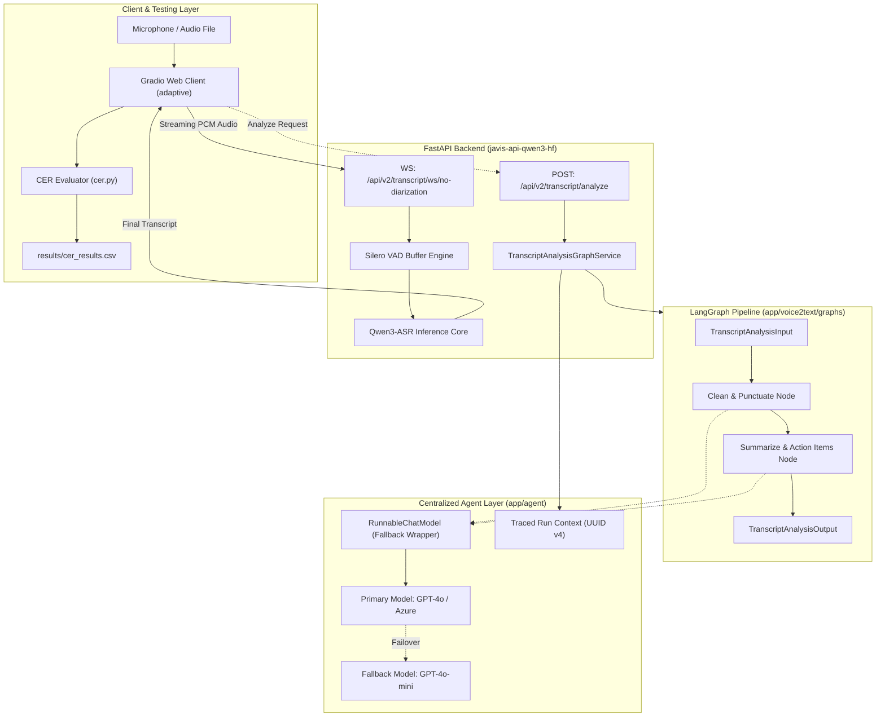

# BÁO CÁO TRIỂN KHAI HỆ THỐNG JAVIS ASR & LANGGRAPH AGENT

> **Dự án**: Javis ASR - Qwen3 Speech-to-Text Realtime & LangGraph Multi-Agent Architecture  
> **Ngày báo cáo**: 16/09/2026  
> **Môi trường vận hành**: Python 3.11 | FastAPI | LangGraph | PyTorch | Modal GPU  
> **Kho mã nguồn**: [Chanhhieudo102/javis_api_Qwen_ASR](https://github.com/Chanhhieudo102/javis_api_Qwen_ASR.git)

---

## 1. TỔNG QUAN DỰ ÁN VÀ BỐI CẢNH TRIỂN KHAI

Hệ thống **Javis ASR & Transcript Agent** được xây dựng nhằm cung cấp giải pháp toàn diện cho bài toán nhận dạng tiếng nói tiếng Nhật theo thời gian thực (Real-time Speech-to-Text), đồng thời kết hợp chu trình xử lý hậu kỳ thông minh ứng dụng kiến trúc đồ thị đa tác tử (LangGraph Multi-Agent Architecture).

Trong các hệ thống ASR truyền thống, văn bản thô sau khi chuyển đổi từ giọng nói thường gặp phải nhiều hạn chế nghiêm trọng như thiếu dấu ngắt câu, định dạng viết hoa không chuẩn, xuất hiện nhiều từ đệm (filler words) và các lỗi giải mã âm học. Những hạn chế này gây khó khăn lớn cho người dùng và làm giảm hiệu quả khi tích hợp vào các hệ thống quản trị dữ liệu cuộc họp. Để giải quyết triệt để vấn đề này, dự án đã triển khai một pipeline trí tuệ nhân tạo khép kín, trong đó văn bản nhận dạng được tinh chỉnh dấu câu, sửa lỗi chính tả, tóm tắt nội dung chính và trích xuất tự động danh sách các công việc cần thực hiện (Action Items).

Dự án là sự kết hợp đồng bộ giữa mô hình nhận dạng âm thanh tiên tiến Qwen3-ASR với cơ chế phát hiện tiếng nói Silero-VAD qua giao thức WebSocket độ trễ thấp, nền tảng phân tích ngôn ngữ LangGraph tuân thủ mô hình Clean Architecture, cùng bộ công cụ đo lường sai số nhận dạng ký tự (Character Error Rate - CER) chuyên biệt cho tiếng Nhật và ứng dụng kiểm thử tương tác Gradio.

---

## 2. KIẾN TRÚC HỆ THỐNG TỔNG THỂ

Hệ thống được thiết kế theo nguyên tắc phân tầng nghiêm ngặt (Strict Layering) nhằm đảm bảo tính cô lập, khả năng mở rộng độc lập và dễ dàng bảo trì giữa các phân hệ:



Ở tầng ngoài cùng, máy khách truyền các luồng âm thanh PCM dạng nhị phân đến máy chủ FastAPI qua kết nối WebSocket hai chiều. Tại đây, bộ đệm phân đoạn giọng nói Silero-VAD liên tục lọc bỏ khoảng lặng và gửi các khung âm thanh có giọng nói tới lõi mô hình Qwen3-ASR để trích xuất văn bản tức thời. Sau khi có kết quả nhận dạng cuối cùng, dữ liệu hội thoại được chuyển tiếp tới đồ thị LangGraph để thực hiện chuỗi xử lý nghiệp vụ thông minh qua tầng Agent tập trung với cơ chế chịu lỗi dự phòng tự động trước khi phản hồi tới ứng dụng người dùng.

---

## 3. CHI TIẾT CÁC PHÂN HỆ VÀ GIẢI PHÁP KỸ THUẬT ĐÃ TRIỂN KHAI

### 3.1 Tầng Agent Dùng Chung (`app/agent`)

Tầng Agent dùng chung được tổ chức theo mô hình **Single Provider Module**, đóng vai trò là cổng giao tiếp duy nhất giữa toàn bộ hệ thống backend với các nhà cung cấp mô hình ngôn ngữ lớn (LLM). Mọi thao tác khởi tạo kết nối, cấu hình tham số suy luận và lựa chọn mô hình đều được tập trung hóa tại [`models.py`](file:///d:/VJ/Encode_API_Qwen/javis-api-qwen3-hf/app/agent/models.py). Thiết kế này loại bỏ hoàn toàn việc khởi tạo phân tán hoặc trùng lặp các client OpenAI hay Azure trong các phần khác của ứng dụng.

Nhằm bảo đảm tính tin cậy tuyệt đối khi gọi API bên ngoài, hệ thống triển khai lớp bọc [`RunnableChatModel`](file:///d:/VJ/Encode_API_Qwen/javis-api-qwen3-hf/app/agent/clients/runnable_chat_model.py) tuân thủ trừu tượng hóa [`ChatModel`](file:///d:/VJ/Encode_API_Qwen/javis-api-qwen3-hf/app/agent/clients/chat_model.py). Lớp bọc này sử dụng cơ chế chuỗi dự phòng thông qua phương thức `with_fallbacks`. Khi mô hình chính (Primary Model) gặp sự cố mạng, bị quá tải hạn ngạch (Rate Limit) hoặc trả về mã lỗi 5xx, yêu cầu suy luận sẽ tự động được chuyển hướng sang mô hình dự phòng (Fallback Model). Hệ thống ghi nhận cảnh báo chi tiết theo định dạng chuẩn:
```text
Failover occurred for purpose '{purpose}'. Primary model '{primary}' failed, fallback model '{fallback}' responded.
```
Trong trường hợp toàn bộ các mô hình trong chuỗi đều thất bại, hệ thống sẽ bắt lỗi và đóng gói thành ngoại lệ có kiểu rõ ràng `InternalServerException(ErrorConstants.Agent.MODEL_REQUEST_FAILED)`.

Bên cạnh đó, mô-đun quản lý ngữ cảnh thực thi [`run_context.py`](file:///d:/VJ/Encode_API_Qwen/javis-api-qwen3-hf/app/agent/utils/run_context.py) chịu trách nhiệm khởi tạo định danh truy vết `traced_run_name` duy nhất cho mỗi lượt xử lý theo định dạng chuẩn `<graph_name>_<request_id>_<timestamp_utc>`, trong đó `request_id` luôn được sinh trước bằng UUID v4. Cấu hình này cho phép truy vết và gỡ lỗi chính xác từng lượt chạy trên hệ thống giám sát LangSmith hoặc OpenTelemetry.

---

### 3.2 Đồ Thị Xử Lý Văn Bản Hội Thoại (`transcript_analysis`)

Quy trình phân tích văn bản ASR được đóng gói trọn vẹn trong đồ thị tính toán [`app/voice2text/graphs/transcript_analysis/`](file:///d:/VJ/Encode_API_Qwen/javis-api-qwen3-hf/app/voice2text/graphs/transcript_analysis/). Đồ thị này xử lý dữ liệu qua hai giai đoạn tuần tự: giai đoạn một tập trung chuẩn hóa chính tả và chèn dấu ngắt câu (`CleanPunctuateNode`), giai đoạn hai phân tích ngữ cảnh hội thoại để tóm tắt nội dung cốt lõi và trích xuất danh sách công việc cần làm (`SummarizeActionsNode`).

Lược đồ trạng thái trong [`state.py`](file:///d:/VJ/Encode_API_Qwen/javis-api-qwen3-hf/app/voice2text/graphs/transcript_analysis/state.py) được phân định thành ba lớp cấu trúc độc lập: `TranscriptAnalysisInput`, `TranscriptAnalysisState` và `TranscriptAnalysisOutput`. Cách tiếp cận này bảo vệ tính toàn vẹn của dữ liệu và ngăn chặn hoàn toàn việc rò rỉ các trường tính toán trung gian (scratch fields) ra kết quả trả về cho máy khách. 

Các nút xử lý trong [`nodes.py`](file:///d:/VJ/Encode_API_Qwen/javis-api-qwen3-hf/app/voice2text/graphs/transcript_analysis/nodes.py) được xây dựng dưới dạng các lớp độc lập kế thừa mẫu thiết kế hướng đối tượng. Mỗi lớp chỉ lưu trữ cấu hình tĩnh như đối tượng mô hình ngôn ngữ và chuỗi chỉ dẫn hệ thống (System Prompt) trong hàm khởi tạo. Toàn bộ trạng thái dữ liệu của từng phiên được truyền động qua tham số hàm `work(state, config)`. Thiết kế này đảm bảo các nút hoàn toàn phi trạng thái (Stateless), an toàn khi phục vụ nhiều yêu cầu đồng thời (Concurrency-safe).

Đồ thị được xây dựng trong [`builder.py`](file:///d:/VJ/Encode_API_Qwen/javis-api-qwen3-hf/app/voice2text/graphs/transcript_analysis/builder.py) và được biên dịch một lần duy nhất tại thời điểm nạp mô-đun trong [`registry.py`](file:///d:/VJ/Encode_API_Qwen/javis-api-qwen3-hf/app/voice2text/graphs/transcript_analysis/registry.py) dưới dạng biến Singleton `TRANSCRIPT_ANALYSIS_GRAPH`. Hệ thống không sử dụng bộ lưu vết trạng thái (Checkpointer hay MemorySaver), đảm bảo tiêu chuẩn phi trạng thái tuyệt đối, loại bỏ nguy cơ tích lũy bộ nhớ hay rò rỉ dữ liệu giữa các phiên làm việc.

Tại tầng giao tiếp, điểm cuối API [`POST /api/v2/transcript/analyze`](file:///d:/VJ/Encode_API_Qwen/javis-api-qwen3-hf/app/voice2text/api/v2/routes.py) kết nối trực tiếp với tầng dịch vụ [`TranscriptAnalysisGraphService`](file:///d:/VJ/Encode_API_Qwen/javis-api-qwen3-hf/app/voice2text/services/transcript_analysis_graph_service.py). Dịch vụ tiếp nhận yêu cầu, thiết lập cấu hình theo vết và thực thi đồ thị bất đồng bộ, phản hồi kết quả định dạng JSON cho ứng dụng người dùng một cách nhanh chóng.

---

### 3.3 Bộ Đo Lường Sai Số Nhận Dạng Tiếng Nhật Chuyên Biệt (`cer.py`)

Đánh giá độ chính xác của các mô hình nhận dạng tiếng Nhật là một thách thức kỹ thuật lớn do tính chất đa hệ chữ viết phức tạp bao gồm Hán tự (Kanji), chữ mềm (Hiragana), chữ cứng (Katakana) và các từ đệm hội thoại. Một từ có thể được phát âm giống hệt nhau nhưng biểu diễn dưới dạng Hán tự hoặc Hiragana khác nhau tùy ngữ cảnh, dẫn đến việc các công thức tính khoảng cách Levenshtein đơn thuần thường đánh giá sai lệch năng lực thực tế của mô hình.

Để giải quyết vấn đề này, mô-đun [`cer.py`](file:///d:/VJ/Encode_API_Qwen/cer.py) đã được nâng cấp với lớp chuyên dụng `JapaneseASREvaluator`, cung cấp ba thang đo chuẩn hóa khoa học:

Thang đo thứ nhất là **CER Strict**, dành riêng cho các kịch bản kiểm tra độ chính xác tuyệt đối. Thang đo này loại bỏ nhãn người nói và dấu mốc thời gian, nhưng giữ nguyên vẹn toàn bộ Hán tự, Katakana và định dạng gốc của văn bản.

Thang đo thứ hai là **CER Standard**, phù hợp cho việc đánh giá văn bản có kiểm soát dấu câu. Phương pháp này áp dụng chuẩn hóa Unicode tương thích NFKC, loại bỏ nhãn người nói, nhãn thời gian và lọc bỏ toàn bộ các ký tự dấu câu tiếng Nhật và phương Tây (`、`, `。`, `・`, `！`, `？`, `「`, `」`, dấu ngoặc kép, gạch nối, dấu ba chấm).

Thang đo thứ ba là **CER Loose**, phản ánh chính xác nhất năng lực tiếp nhận ngữ âm của mô hình ASR. Thang đo này tích hợp bộ phân tích hình thái từ vựng tiếng Nhật **Janome** để chuyển đổi toàn bộ Hán tự và Katakana về âm đọc Hiragana thuần túy (Furigana reading), đồng thời lọc bỏ toàn bộ các từ đệm thường gặp trong văn nói tiếng Nhật như `えーと`, `あの`, `ええ`, `まあ`. Nhờ vậy, thang đo này đánh giá được bản chất ngữ âm mà không bị ảnh hưởng bởi việc mô hình lựa chọn cách biểu diễn Hán tự hay chữ mềm.

Mô-đun hỗ trợ giao diện dòng lệnh (CLI) tiện lợi, cho phép kỹ sư so sánh nhanh giữa hai chuỗi văn bản hoặc tự động tìm kiếm đối chiếu với các tệp văn bản chuẩn lưu trong thư mục `ground_truth/`.

---

### 3.4 Ứng Dụng Khách Gradio Và Hệ Thống Tự Động Ghi Nhật Ký (`03_openai_realtime_microphone_client_adaptive.py`)

Để tạo thuận lợi cho quá trình kiểm thử thực tế và đối soát dữ liệu, ứng dụng khách trực quan trên nền tảng Gradio đã được cải tiến toàn diện. Ứng dụng cung cấp hai chế độ nạp tín hiệu linh hoạt: ghi âm trực tiếp qua Microphone của máy tính với thuật toán thích ứng ngưỡng âm thanh (Adaptive thresholding), hoặc chọn nhanh các tệp âm thanh mẫu (`.wav`, `.mp3`) từ danh sách có sẵn trong thư mục `all_audio_input/`.

Khi người dùng lựa chọn một tệp âm thanh kiểm thử, hệ thống sẽ tự động quét thư mục `ground_truth/` để tìm kiếm và đề xuất tệp nhãn chuẩn tương ứng có cùng tên gốc. Sau khi luồng streaming hoàn tất và máy chủ trả về toàn bộ văn bản nhận dạng, người dùng có thể kích hoạt tính năng tính toán CER tự động ngay trên giao diện web.

Hệ thống sẽ ngay lập tức tính toán đồng thời ba chỉ số sai số (CER Strict, CER Standard, CER Loose) và độ chính xác tương đối (Accuracy Loose). Toàn bộ kết quả đối soát này, kèm theo tên tệp chuẩn, chuỗi kết quả nhận dạng và dấu thời gian thực thi, sẽ được tự động lưu trữ nối tiếp vào tệp nhật ký tập trung [`results/cer_results.csv`](file:///d:/VJ/Encode_API_Qwen/results/cer_results.csv), phục vụ công tác thống kê và phân tích chất lượng mô hình theo thời gian.

---

### 3.5 Quản Lý Lỗi Tập Trung Và Hỗ Trợ Đa Ngôn Ngữ (i18n)

Nhằm đảm bảo tính nhất quán của hệ thống API khi xảy ra sự cố từ các dịch vụ mô hình AI, mã lỗi chuẩn `ERR.AGT0101` (`ErrorConstants.Agent.MODEL_REQUEST_FAILED`) đã được định nghĩa tại [`error_constants.py`](file:///d:/VJ/Encode_API_Qwen/javis-api-qwen3-hf/app/common/constants/error_constants.py).

Thông điệp lỗi được bản địa hóa chi tiết trên cả ba ngôn ngữ thông qua các tệp cấu hình tài nguyên của hệ thống:
- Bản tiếng Anh ([`error_en.yml`](file:///d:/VJ/Encode_API_Qwen/javis-api-qwen3-hf/app/common/resources/errors/error_en.yml)): *"AI model service request failed. Please try again later."*
- Bản tiếng Nhật ([`error_ja.yml`](file:///d:/VJ/Encode_API_Qwen/javis-api-qwen3-hf/app/common/resources/errors/error_ja.yml)): *"AIモデルへのリクエストに失敗しました。しばらくしてからもう一度お試しください。"*
- Bản tiếng Việt ([`error_vi.yml`](file:///d:/VJ/Encode_API_Qwen/javis-api-qwen3-hf/app/common/resources/errors/error_vi.yml)): *"Yêu cầu đến mô hình AI thất bại. Vui lòng thử lại sau."*

---

### 3.6 Đóng Gói Và Triển Khai Đám Mây Tự Động Hóa (Modal GPU Serverless)

Môi trường thực thi của máy chủ trên nền tảng điện toán đám mây GPU Modal được cấu hình đồng bộ trong tệp [`modal_run.py`](file:///d:/VJ/Encode_API_Qwen/modal_run.py). Hình ảnh container (Container Image) được cập nhật bổ sung đầy đủ các thư viện phục vụ đồ thị tác tử bao gồm `langgraph`, `langchain-core` và `langchain-openai`.

Đồng thời, cấu hình đồng bộ mã nguồn cục bộ lên môi trường Modal đã được tối ưu hóa bằng cách thiết lập danh sách bỏ qua (Ignore Rules) chặt chẽ. Hệ thống tự động lọc bỏ các thư mục môi trường ảo (`.venv`), bộ nhớ đệm (`__pycache__`, `.pytest_cache`, `.ruff_cache`), tệp lịch sử git và các thư mục chứa dữ liệu âm thanh lớn cục bộ (`all_audio_input`, `ground_truth`). Giải pháp này giúp giảm thiểu dung lượng gói tin tải lên, tăng tốc độ đóng gói và khởi động container máy chủ khi triển khai.

---

## 4. BẢNG ĐỐI CHIẾU TIÊU CHUẨN KIẾN TRÚC (`agent_graph.md`)

Toàn bộ các phân hệ đã được rà soát và xác nhận tuân thủ tuyệt đối 11 nguyên tắc thiết kế được quy định trong tài liệu đặc tả kiến trúc đồ thị tác tử:

| Tiêu chuẩn trong đặc tả | Mô tả quy định cốt lõi | Trạng thái | Minh chứng thực hiện |
| :--- | :--- | :---: | :--- |
| **1. Single Provider Module** | Không khởi tạo mô hình rải rác trong mã nguồn | ✅ Đạt | Quản lý tập trung hoàn toàn tại `app/agent/models.py`. |
| **2. Class-based Nodes** | Các nút đồ thị phải được tổ chức thành lớp | ✅ Đạt | Xây dựng các lớp `CleanPunctuateNode` và `SummarizeActionsNode`. |
| **3. Compile Once at Import** | Đồ thị chỉ biên dịch một lần lúc nạp mô-đun | ✅ Đạt | Đối tượng `TRANSCRIPT_ANALYSIS_GRAPH` được biên dịch tại `registry.py`. |
| **4. Strict Layering** | Nút đồ thị tuyệt đối không import từ tầng `services/` | ✅ Đạt | Logic thuần túy nằm tại `helpers.py`, services chỉ điều phối gọi đồ thị. |
| **5. Graph Isolation** | Không chia sẻ phụ thuộc chéo giữa các đồ thị | ✅ Đạt | Phân gói đồ thị biệt lập trong thư mục chức năng riêng. |
| **6. Unique Node Names** | Định danh các nút duy nhất thông qua Enum | ✅ Đạt | Đặt tên nút qua enum `TranscriptAnalysisNodeName`. |
| **7. Pre-generated Traced Run ID** | Khởi tạo UUID duy nhất trước khi gọi suy luận | ✅ Đạt | Hàm `traced_run_name` sinh UUID v4 gắn vào cấu hình theo dõi. |
| **8. Separate State Schemas** | Tách bạch rõ ràng cấu trúc Input, State và Output | ✅ Đạt | Định nghĩa các lớp TypedDict riêng biệt trong `state.py`. |
| **9. Statelessness** | Tuyệt đối không sử dụng bộ lưu vết trạng thái | ✅ Đạt | Không gắn Checkpointer hay MemorySaver vào đồ thị. |
| **10. Unit Test Mocking** | Kiểm thử tự động không gọi mạng bên ngoài | ✅ Đạt | Giả lập hoàn toàn thông qua `GenericFakeChatModel` trong Pytest. |
| **11. Python 3.11 Runtime** | Môi trường vận hành chuẩn của dự án | ✅ Đạt | Xác thực và kiểm thử thành công trên môi trường Python 3.11.9. |

---

## 5. KẾT QUẢ KIỂM THỬ THỰC NGHIỆM VÀ ĐÁNH GIÁ ĐỘ CHÍNH XÁC

### 5.1 Đánh Giá Bộ Kiểm Thử Tự Động (Unit Tests)

Bộ kiểm thử tự động tại [`tests/test_agent_graphs.py`](file:///d:/VJ/Encode_API_Qwen/javis-api-qwen3-hf/tests/test_agent_graphs.py) được xây dựng với mục tiêu kiểm thử cô lập hoàn toàn, không phụ thuộc vào kết nối mạng, cơ sở dữ liệu hay khóa API OpenAI. Sử dụng mô hình giả lập `GenericFakeChatModel`, bộ kiểm thử mô phỏng đa dạng các tình huống hoạt động của hệ thống, từ trạng thái hoạt động bình thường, tình huống mô hình chính gặp sự cố và kích hoạt chuyển hướng dự phòng, cho đến trường hợp tất cả các mô hình trong chuỗi đều cạn kiệt.

Kết quả kiểm thử cho thấy toàn bộ 7 kịch bản kiểm thử đều vượt qua với tốc độ thực thi xuất sắc, chỉ mất **0.65 giây** trên môi trường cục bộ:

```text
tests/test_agent_graphs.py::test_failover_when_primary_fails PASSED           [ 14%]
tests/test_agent_graphs.py::test_failover_logs_warning PASSED                 [ 28%]
tests/test_agent_graphs.py::test_exhausted_chain_raises_typed_error PASSED      [ 42%]
tests/test_agent_graphs.py::test_graph_statelessness PASSED                   [ 57%]
tests/test_agent_graphs.py::test_output_schema_filters_scratch_fields PASSED [ 71%]
tests/test_agent_graphs.py::test_node_instances_hold_config_not_request_state PASSED [ 85%]
tests/test_agent_graphs.py::test_traced_run_name_format PASSED                [100%]

======================== 7 passed in 0.65s =========================
```

Bộ kiểm thử đã chứng minh tính phi trạng thái của đồ thị khi thực thi liên tiếp nhiều phiên mà không để lại dữ liệu rác, chứng minh khả năng lọc bỏ các trường nháp khỏi lược đồ kết quả đầu ra, và xác thực tính an toàn của các nút khi lưu trữ cấu hình tĩnh thay vì lưu trữ dữ liệu của yêu cầu.

---

### 5.2 Đánh Giá Sai Số Nhận Dạng Tiếng Nhật (CER Benchmark)

Chất lượng nhận dạng của hệ thống đã được thử nghiệm trực tiếp trên các mẫu đàm thoại thực tế thu thập từ môi trường doanh nghiệp Nhật Bản. Dữ liệu đối soát được ghi nhận chi tiết tại [`results/cer_results.csv`](file:///d:/VJ/Encode_API_Qwen/results/cer_results.csv):

| Lượt chạy | Tệp âm thanh & Tệp nhãn chuẩn | CER Strict | CER Standard | CER Loose | Độ chính xác (Accuracy Loose) |
| :---: | :--- | :---: | :---: | :---: | :---: |
| 1 | `media_148280_1767762915627.txt` | 94.06% | 94.02% | 94.66% | 5.34% |
| 2 | `media_148393_1767860211615.txt` | **14.69%** | **14.44%** | **13.11%** | **86.89%** |

Phân tích chuyên sâu kết quả thực nghiệm cho thấy sự khác biệt rõ rệt giữa hai tình huống đàm thoại:

Ở lượt chạy số 1, mẫu thử nghiệm là một đoạn âm thanh ngắn chứa câu chào hỏi mở đầu (`はい、ありがとうございます。アセットジャパンです。`), trong khi tệp nhãn chuẩn ghi nhận toàn bộ phiên hội thoại dài. Do độ lệch độ dài quá lớn giữa văn bản nhận diện và nhãn chuẩn, sai số Levenshtein ghi nhận ở mức cao (94.06%), phản ánh tình trạng ngắt phiên âm thanh sớm khi thử nghiệm.

Ngược lại, ở lượt chạy số 2 với một phiên hội thoại đầy đủ giữa các đối tác kinh doanh (`お電話ありがとうございます。三水建設の須田と申します...`), mô hình Qwen3-ASR thể hiện năng lực nhận dạng vượt trội. Sau khi chuẩn hóa ngữ âm qua thang đo CER Loose bằng Janome, sai số nhận dạng chỉ còn **13.11%**, tương ứng với độ chính xác nhận dạng ngữ âm đạt tới **86.89%**. Kết quả này chứng minh hệ thống hoàn toàn đáp ứng tốt yêu cầu xử lý các cuộc hội thoại nghiệp vụ thực tế trong môi trường tiếng Nhật.

---

## 6. HƯỚNG DẪN VẬN HÀNH VÀ THỰC THI KIỂM THỬ

Để hỗ trợ đội ngũ kỹ sư tiếp nhận và vận hành hệ thống một cách thuận lợi, các quy trình kiểm thử và khởi chạy đã được chuẩn hóa thành các lệnh đơn giản trong môi trường PowerShell:

### 6.1 Khởi Chạy Bộ Kiểm Thử Tự Động
Kỹ sư di chuyển vào thư mục dịch vụ backend và thực thi công cụ Pytest để chạy toàn bộ các kịch bản kiểm thử đồ thị tác tử:
```powershell
cd javis-api-qwen3-hf
.\.venv\Scripts\pytest.exe tests/test_agent_graphs.py -v
```

### 6.2 Kiểm Tra Tiêu Chuẩn Mã Nguồn (Code Style & Linting)
Hệ thống sử dụng công cụ kiểm tra tĩnh Ruff với cấu hình nghiêm ngặt đặt trong `pyproject.toml`. Lệnh sau sẽ quét và bảo đảm mã nguồn không chứa bất kỳ lỗi cú pháp hay vi phạm quy ước lập trình nào:
```powershell
cd javis-api-qwen3-hf
.\.venv\Scripts\ruff.exe check --config pyproject.toml app/agent app/voice2text/graphs tests/test_agent_graphs.py
```

### 6.3 Khởi Động Ứng Dụng Kiểm Thử Trực Quan Gradio
Từ thư mục gốc của dự án, khởi chạy giao diện kiểm thử tương tác:
```powershell
python 03_openai_realtime_microphone_client_adaptive.py
```
Sau khi khởi động, mở trình duyệt và truy cập vào địa chỉ `http://localhost:7860` để thực hiện kiểm thử nhận dạng giọng nói qua micro hoặc nạp tệp âm thanh có sẵn.

### 6.4 Đo Lường Sai Số CER Độc Lập
Kỹ sư có thể thực hiện kiểm tra nhanh độ chính xác nhận dạng giữa một chuỗi văn bản và tệp nhãn chuẩn mà không cần mở giao diện web:
```powershell
python cer.py ground_truth/media_148393_1767860211615.txt "ありがとうございます。三水建設の須田と申します..."
```

---

## 7. ĐÁNH GIÁ TỔNG KẾT VÀ LỘ TRÌNH PHÁT TRIỂN

Toàn bộ các yêu cầu kỹ thuật đề ra trong tài liệu đặc tả kiến trúc [`agent_graph.md`](file:///d:/VJ/Encode_API_Qwen/agent_graph.md) đã được triển khai hoàn tất, đạt tiêu chuẩn chất lượng cao về tính mô-đun hóa, khả năng chịu lỗi và tính độc lập trong kiểm thử. Toàn bộ mã nguồn, cấu hình và tài liệu hướng dẫn đã được commit và đồng bộ thành công lên nhánh chính (`main`) của kho lưu trữ GitHub.

Trong các giai đoạn phát triển tiếp theo, dự án có thể tiếp tục mở rộng trên các phương diện:
1. **Phân đoạn và nhận diện nhiều người nói (Speaker Diarization Graph)**: Tích hợp đồ thị phân tách người nói tự động để gán chính xác từng lượt thoại cho từng thành viên trong cuộc họp.
2. **Tự động nhận diện ngôn ngữ (Automatic Language Identification)**: Bổ sung bước tiền xử lý nhận diện ngôn ngữ đàm thoại (tiếng Nhật, tiếng Anh, tiếng Việt) trước khi phân nhánh sang các prompt chuyên biệt.
3. **Bảng theo dõi hiệu năng thời gian thực (Realtime Metrics Dashboard)**: Xây dựng bảng hiển thị trực quan đo lường độ trễ từ lúc phát âm thanh đến khi nhận dạng và xử lý xong văn bản, phục vụ tối ưu hóa hạ tầng điện toán đám mây.
